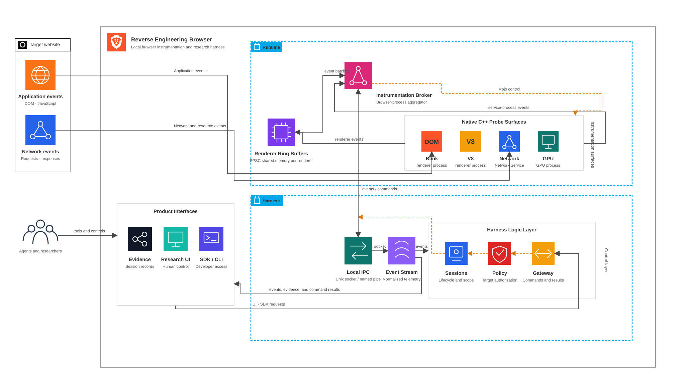

# System Architecture

This diagram describes the implemented repository paths. The broader
[technical architecture](./technical-architecture.md) describes the intended
product direction; components in that design are not all implemented. The SVG
is the editable diagram source.

## Native capture and local evidence

1. Native Canvas, Web Audio, and request-initiation probes write fixed 320-byte
   records to a bounded shared-memory **multi-producer, single-consumer (MPSC)**
   queue per renderer. Render and worker threads produce events; the browser
   process is the sole consumer. Mojo carries session configuration, lifecycle,
   and coalesced wake-ups. Disabled or expired capture returns before insertion.
2. The browser-process bridge drains renderer queues and observes network
   lifecycle metadata through Brave's existing URL loader proxies. A separate
   bounded writer delivers records over an authenticated user-only Unix socket.
   Renderer probes never wait for storage or open harness sockets.
3. The event broker validates records, enforces the session ID, category mask,
   and expiration, reports sequence gaps, and writes versioned JSONL evidence.
   Optional cold-path indexes write Origin Trace edges and request signal
   profiles. Identifier relationships support observed or correlated links,
   not arbitrary JavaScript value provenance.
4. Authorized JavaScript and WASM response content and runtime-generated source
   use a separate artifact path. Runtime source arrives through a bounded Mojo
   submission; response bytes use an asynchronous browser-process tee. Neither
   puts artifact bytes into the renderer event queue. The artifact receiver
   commits SHA-256 blobs and manifest records before acknowledging acceptance.
   Failed captures become explicit events.
5. Origin Trace reads bounded projections of evidence and artifact stores.
   The cold-path VM analyzer reads events and artifacts and writes a separate
   derived analysis document. It never runs inside a probe, browser capture
   path, broker, or artifact receiver, and never overwrites original bytes.

The current live transports are Unix sockets. Windows named pipes are part of
the broader design, not a shipped transport. Capture policy enforces categories
and expiration; the native event envelope does not yet provide the trustworthy
origin identity needed for origin allowlisting.

Implementation and contracts:
[native probes](../../browser/integration/brave/overlay/components/reverse_engineering_browser/README.md),
[event broker](../../services/event-broker/README.md),
[artifact receiver](../../services/artifact-receiver/README.md), and
[shared protocol](../../protocol/README.md).

## Application and optional live debugging

The normal macOS application uses Swift and WKWebView. `make app` opens the
bundled interface with native evidence readers; `make ui` serves the browser
development interface from Python. `make live` starts the local capture
services, analysis worker, Python server, private Brave profile, and the native
app window pointed at the local server.

Live debugging is a separate, optional path: a loopback DevTools WebSocket
connects Brave to `reb-debugger-transport`, a bounded C++ helper. Versioned
private process pipes connect that helper to the Python debugger-state and
policy adapter. The UI uses allowlisted local routes for debugger, source,
memory, and experiment operations. Runtime values and debugger state stay
ephemeral rather than entering the native evidence store.

Memory inspection uses bounded C++ heap analysis; Decoder Lab uses a separate
native transform helper. API Collection and Local Analyst Workspace persist
user-authored templates and scripts separately from captured evidence. Analyst
scripts run explicitly in a restricted helper with selected evidence inputs.

Request interception, Repeater, Object Lab, Runtime Hook Studio, and automation
recipes share a disposable experiment BrowserContext. Mutating operations are
explicit and do not inherit the baseline target's cookies or storage. This
experiment path is distinct from observational native capture.

`REB_NATIVE_QUIET_MODE=1 make live` omits the DevTools endpoint and debugger
transport. Native capture and Captured Sources remain available; live debugger
and CDP-dependent tools are unavailable. This mode also explicitly enables the
patched V8 behavior that ignores page-authored `debugger;` statements.

See the [Origin Trace operating guide](../../apps/research-ui/README.md) and
[live-session launcher](../../scripts/run-live-session.sh) for mode-specific
behavior and limits.

## Scope and verification

The diagram separates existing paths from planned broader Blink, V8, and GPU
probe coverage, origin-aware capture authorization, a general agent SDK and
gateway, and exact field-level value provenance. A supported event category or
UI view does not imply complete native probe coverage. MCP remains deferred.

Tracked Brave overlays and patches are implemented integration sources, not
proof that a complete custom browser has been compiled on every host. Native,
socket, fixture, and UI tests validate their respective boundaries; a full
browser build additionally requires the pinned Brave and Chromium toolchain.
See the [Brave integration guide](../../browser/integration/brave/README.md)
and [feature roadmap](../product/feature-list.md).
