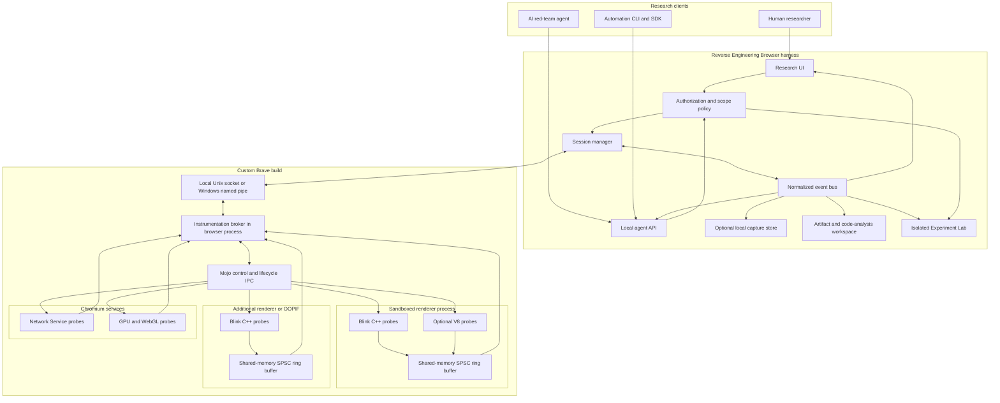
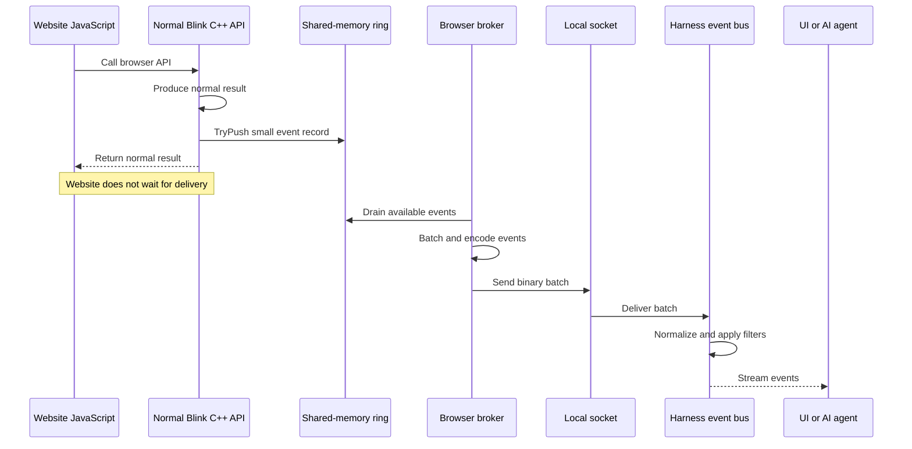
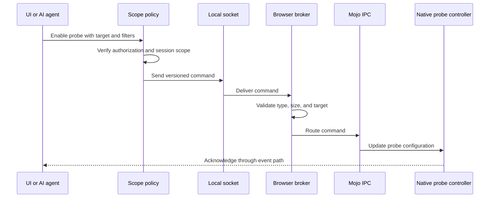
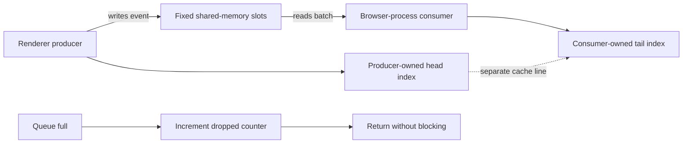
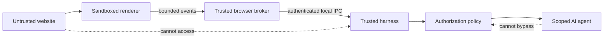
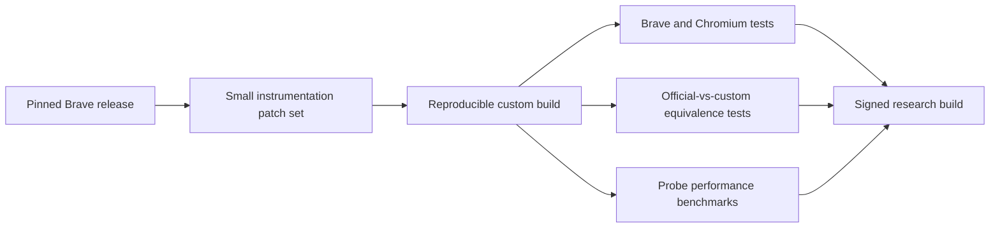

# Reverse Engineering Browser

## Purpose

Reverse Engineering Browser is a Brave-based browser harness for authorized website security research. AI agents and human researchers can observe browser behavior without injecting JavaScript wrappers into the page.

The browser preserves normal Brave behavior while native C++ probes report selected events through a private local transport.

## Design goals

1. Preserve normal Brave API results and browser behavior.
2. Keep instrumentation outside the website JavaScript environment.
3. Never block the renderer while recording an event.
4. Support humans and AI agents through the same versioned API.
5. Keep all control and event traffic local by default.

## System architecture



## Event data path

Website-facing calls remain synchronous and normal. Recording and delivery happen separately.



## Command and control path

Commands travel in the opposite direction. The browser process validates them and uses Mojo to reach the correct renderer, frame, or service.



## Browser internals

### Blink probes

Blink is the primary instrumentation layer for DOM, Canvas, Web Audio, WebGL-facing APIs, navigation, storage, permissions, and navigator properties.

Each probe must:

- observe without replacing JavaScript functions;
- preserve return values, exceptions, descriptors, and call order;
- write a bounded event record;
- avoid disk, sockets, JSON, and blocking locks;
- remain disabled unless a scoped session enables it.

Illustrative probe:

```cpp
String HTMLCanvasElement::toDataURL(...) {
  String result = ToDataURLInternal(...);

  if (ProbeRegistry::CanvasEnabled()) [[unlikely]] {
    ProbeRegistry::CanvasQueue().TryPush({
        .type = ProbeEventType::kCanvasToDataURL,
        .timestamp = base::TimeTicks::Now(),
        .frame_token = CurrentFrameToken(),
        .result = result,
    });
  }

  return result;
}
```

### V8 probes

Use V8 only for information Blink cannot provide. V8 instrumentation can disturb optimization, garbage collection, stack generation, or execution timing more easily than targeted Blink probes.

### Network Service probes

Observe request and response metadata inside Chromium's Network Service. Keep response bodies opt-in and size-limited. Credentials, cookies, and authorization headers require explicit session permission and must be redacted from ordinary logs.

### GPU process probes

GPU and WebGL operations may execute outside the renderer. Use dedicated probes only when Blink-level observations are insufficient. High-volume graphics events require aggregation rather than one event per operation.

## Shared-memory event transport

Each renderer receives a bounded single-producer, single-consumer ring buffer from the browser process.



Recommended properties:

- fixed capacity with an explicit memory budget;
- fixed-size event headers and bounded payload references;
- producer and consumer indexes on separate cache lines;
- monotonic sequence numbers and timestamps;
- drop counters for every event category.

Large artifacts use the separate bounded transfer contract described in
[Artifact Transfer Channel - Low-Level Design](./artifact-transfer-channel.md).
The hot ring contains only small evidence events and artifact correlation IDs.
The browser process, never the renderer probe, owns the artifact stream.

## Local transport

The browser process owns one long-lived connection to the harness:

- Unix domain socket on macOS and Linux;
- named pipe on Windows;
- binary, length-prefixed, versioned messages;
- authenticated peer with user-only operating-system permissions;
- bounded outgoing batches with explicit drop behavior.

The local transport carries no website traffic and must never listen on a public network interface.

## Event model

Every event uses a common envelope:

```text
protocol_version
session_id
sequence_number
monotonic_timestamp
navigation_id
process_id
frame_token
execution_context_id
worker_token
parent_event_id
artifact_id
origin
event_type
flags
payload_length
payload
```

Events should preserve their original timestamps and sequence numbers even when the UI displays them later.

The additional correlation fields are required for causality: a navigation identifies one page lifetime, an execution context or worker identifies where code ran, an artifact identifies the source file or WASM module, and a parent event connects a derived event to the event that caused it.

## Agent API

The agent API exposes capabilities rather than unrestricted browser internals:

```text
session.create(scope)
session.close()
probe.enable(type, target, filters)
probe.disable(type, target)
events.subscribe(types, filters)
events.snapshot(limit)
browser.navigate(url)
browser.interact(action)
capture.export(format)
```

Every session defines allowed origins, probe categories, data sensitivity, rate limits, and an expiration time.

## Artifact and code-analysis workspace

The harness catalogs every JavaScript artifact, inline script, worker script, source map, and WebAssembly module that loads during a session. Each catalog entry retains immutable original bytes and a content hash, URL, initiator, frame or worker, load time, and execution context.

The workspace presents three linked views:

1. original source or module bytes;
2. a derived readable representation;
3. a transformation and evidence log.

Artifacts are classified as readable, minified, or likely obfuscated. Derived JavaScript views may use formatting, source maps, safe static simplification, recovered string tables, and descriptive identifier labels. Virtualized code receives a dedicated bytecode workspace with bytecode traversal, opcode labels, disassembly, and annotations.

The original artifact is never overwritten. Every derived source range must map back to the original bytes and every transformation must state why it was performed. Extracted code must not be automatically executed.

WebAssembly gets a parallel workspace: original module bytes, hash, imports, exports, strings, readable disassembly, compile and instantiation history, traps, and links to JavaScript callers and browser events.

## Value causality and network correlation

Researchers and agents investigate a value from a request field, browser-API event, JavaScript object, or WebAssembly boundary. The browser presents a short causal story:

```text
created here -> transformed here -> serialized here -> sent here
```

Every claim has a confidence label:

- **exact**: the value crossed an instrumented browser or WASM boundary;
- **inferred**: an observed creation or mutation boundary strongly identifies the source;
- **heuristic**: snapshot, replay, or structural-similarity analysis identifies the most likely origin.

Network correlation links an outgoing request or response to the scripts, WASM modules, browser APIs, and value transformations involved in producing or consuming it. Sensitive values are redacted by default, and request or response bodies remain opt-in and size-limited.

The UI must support source-to-event and event-to-source navigation, exact and structural-similarity search, causal timelines, and comparison of two authorized runs.

### Dynamic-code provenance and async causality

The artifact catalog must include code created after initial page load: dynamic module imports, blob and data URLs, workers, `eval`, `Function` constructors, injected script elements, and WebAssembly compiled from runtime bytes. Each generated artifact records its creator event, parent artifact, original bytes or source string when available, execution context, and first execution time.

The browser also maintains an async causality graph. It links scheduling and continuation boundaries across events, promises, microtasks, timers, message channels, workers, and frame boundaries. A request, browser API call, or derived value can therefore be traced across asynchronous hops to its originating user action, script, or WASM module.

The graph is evidence-based. Missing or ambiguous links remain visible as gaps rather than being silently inferred.

## Experiment Lab

The Experiment Lab lets a researcher create a controlled, disposable experiment from a selected script, function, WASM module, or captured request. It is separate from the active website document and never inherits production cookies, account state, or session credentials.

Three modes are supported:

1. **Static lab**: parse, deobfuscate, inspect strings, imports, exports, and control flow without executing code.
2. **Detached execution lab**: execute selected code in a throwaway origin and profile using explicit fixtures for DOM state, storage, inputs, permissions, and API responses.
3. **Full-page replay lab**: replay an authorized page scenario in an isolated profile, with explicit dependency stubs and a recorded comparison against the captured session.

Experiments record inputs, fixture versions, browser build, configuration, observed events, outputs, and differences from the source session. They can be discarded or saved as a reproducible evidence bundle. The lab is never an invisible modification layer inside a live website.

## Performance rules

1. Never block the renderer for the UI, socket, storage, or agent.
2. Batch renderer notifications and external socket writes.
3. Filter as close to the probe as possible.
4. Drop or sample high-volume events when buffers fill.
5. Benchmark every probe against the matching official Brave build.

Measure synchronous API latency, page-load time, frame rate, CPU use, memory use, queue drops, and background power consumption.

## Browser-observable surface

The custom transport, shared memory, and Mojo interfaces are not directly exposed to website JavaScript. A website can only observe their side effects.

Potential side effects include:

- increased synchronous API latency;
- background CPU contention or power use;
- changed return values, errors, ordering, or object lifetimes;
- unusual browser launch settings or enabled features;
- behavior produced by automation rather than instrumentation.

The browser should use Brave's normal UI, profile behavior, sandbox, network stack, feature configuration, and launch settings. It should not require Puppeteer, injected extensions, remote debugging ports, JavaScript wrappers, `Debugger.enable`, or `Runtime.enable` for native observation.

The engineering target is observational equivalence with the corresponding official Brave release for all preserved web-facing surfaces. Absolute undetectability is not a testable guarantee.

## Security boundaries



Security requirements:

- preserve Chromium's renderer sandbox;
- authenticate the local harness connection;
- validate every message and payload length;
- enforce origin and session scope before commands reach probes;
- maintain an audit log of agent commands and sensitive captures.

## Build and update pipeline



Keep the patch set narrow and rebase it for every supported Brave release. Never disguise an old browser version as a current one.

## Delivery phases

### Phase 1: Browser foundation

- build an unmodified pinned Brave release;
- add the browser-process instrumentation broker;
- establish Mojo lifecycle control;
- add the authenticated local socket;
- prove renderer crash and reconnect behavior.

### Phase 2: First native probe

- implement one low-frequency Blink probe;
- add a per-renderer shared-memory ring;
- stream events into a minimal CLI;
- validate outputs against official Brave;
- measure latency and drop behavior.

### Phase 3: Harness and agent API

- implement sessions and authorization scope;
- add the normalized event bus;
- expose the versioned agent API;
- add local capture storage;
- implement audit logging.
- add artifact cataloging and source-to-event navigation.

### Phase 4: Coverage

- add Canvas and Web Audio probes;
- add navigation and storage probes;
- add scoped Network Service probes;
- add OOPIF and worker coverage;
- add filtered GPU and WebGL observations.
- add the readable-code workspace and WASM module view;
- add exact value provenance at instrumented boundaries and request correlation;
- add dynamic-code provenance and async causality edges;
- add static Experiment Lab support.

### Phase 5: Production hardening

- automate Brave upstream rebases;
- run browser compatibility suites;
- compare official and custom fingerprints;
- fuzz IPC decoders and probe payloads;
- sign and package releases for each platform.
- add isolated detached-execution and full-page replay lab modes;
- test evidence-bundle reproducibility and sensitive-data redaction.

## Initial success criteria

The first milestone is complete when:

1. A normal page calls one instrumented Blink API and receives the official Brave result.
2. The renderer adds a bounded event without waiting for the harness.
3. The harness receives the event through shared memory and a local socket.
4. Closing the harness does not pause or crash the browser.
5. Official and custom Brave pass the same compatibility and fingerprint regression suite.
